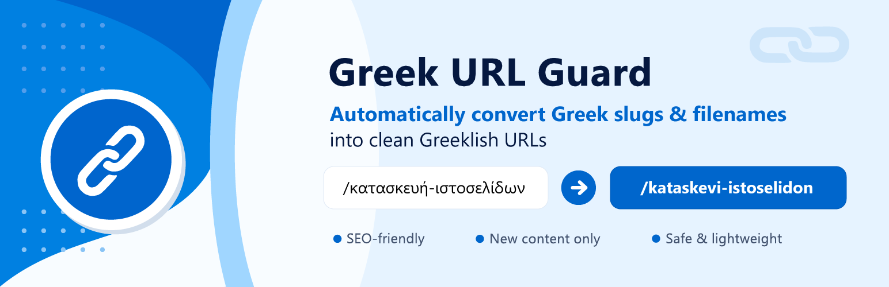
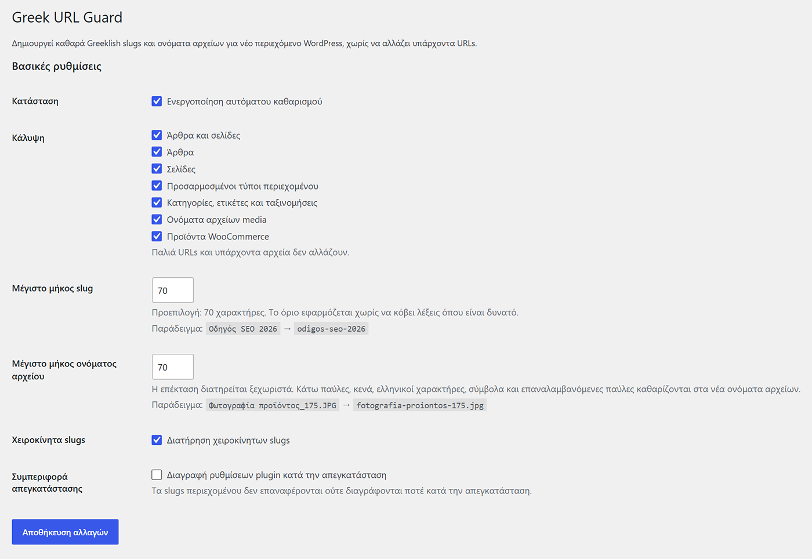
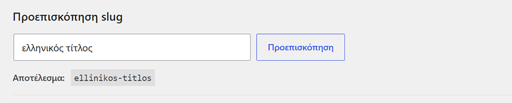
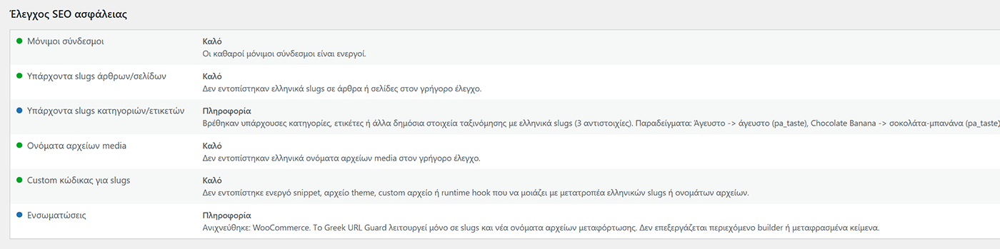

  

<h1 align="center">Greek URL Guard</h1>

Automatically convert Greek WordPress slugs and media filenames into clean, SEO-friendly Greeklish URLs without changing existing URLs.

---

## Overview

Greek URL Guard automatically converts **new Greek slugs** and **new media filenames** into clean Greeklish equivalents while keeping existing URLs untouched.

Instead of rewriting published content, the plugin focuses only on newly created content, helping maintain permalink stability and reducing the risk of broken links or unnecessary redirects.

---

## Key Features

- ✅ Automatically converts Greek slugs to Greeklish
- ✅ Converts media filenames during upload
- ✅ Keeps existing URLs unchanged
- ✅ Supports Posts & Pages
- ✅ Supports Custom Post Types
- ✅ Supports Categories, Tags & Taxonomies
- ✅ Supports WooCommerce products
- ✅ Built-in slug preview tool
- ✅ Built-in SEO safety check
- ✅ Lightweight and fast
- ✅ Translation ready

---

## Why Greek URL Guard?

Many slug conversion plugins modify existing URLs, which may create SEO issues or require redirects.

Greek URL Guard follows a safer approach:

- Existing URLs remain untouched
- Only new content is converted
- Existing uploaded files are never renamed
- Manual slugs can be preserved
- Configurable slug and filename length

This makes it suitable for both new and established WordPress websites.

---

## Screenshots

### Main Settings

---

### Slug Preview Tool

---

### SEO Safety Check

---

## Installation

1. Upload the plugin to `/wp-content/plugins/`
2. Activate **Greek URL Guard**
3. Go to **Settings → Greek URL Guard**
4. Configure the desired options

---

## Requirements

- WordPress 6.5 or newer
- PHP 7.4 or newer

---

## Frequently Asked Questions

### Does it modify existing URLs?

No.

Existing posts, pages, products and uploaded media remain unchanged.

Only newly created content is processed.

### Does it support WooCommerce?

Yes.

Products, product categories, product tags and product attributes are supported.

### Does it rename existing media files?

No.

Only files uploaded after activation are processed.

---

## Documentation

Plugin page:

https://ccdesign.gr/en/wordpress-plugins/greek-url-guard

---

## Developed by

**CCDesign.gr**

Technical SEO • WordPress Development • Web Performance

🌐 https://ccdesign.gr

---

## License

Released under the GNU GPL v2 or later.
